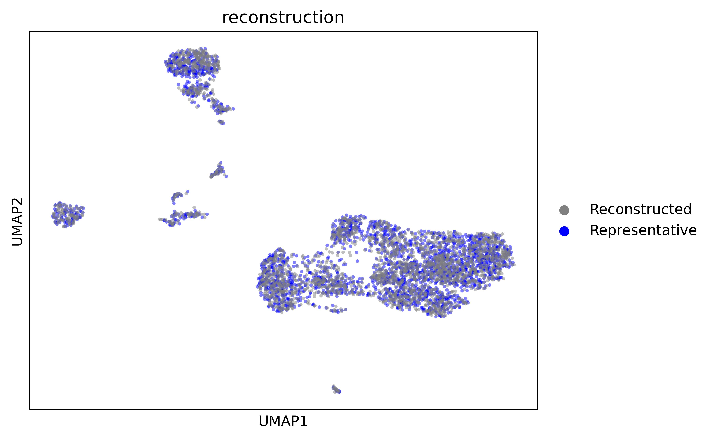

# scSemiProfiler: Advancing Large-scale Single-cell Studies through Semi-profiling with Deep Generative Models and Active Learning

scSemiProfiler is an innovative computational tool combining deep generative models and active learning to economically generate single-cell data for biological studies. It efficiently transforms bulk cohort data into detailed single-cell data using templates from selected representative samples. More details are in our [paper](https://www.biorxiv.org/content/10.1101/2023.11.20.567929v1). 

## Method Overview

For an interested cohort, scSemiProfiler runs the following steps to generate single-cell data for all samples.

**a**, Initial Setup: Bulk sequencing is first performed on the entire cohort, with subsequent clustering analysis of this data to pinpoint representative samples, typically those closest to the cluster centroids.

**b**, Representative Profiling: The identified representatives are then subjected to single-cell sequencing. The data obtained from this sequencing is further processed to determine gene set scores and feature importance weights, enriching the subsequent analysis steps.

**c**, Deep Generative Inference: This phase uses a VAE-GAN-based model to estimate single-cell data for a target sample. In its three-stage training, the model initially reconstructs the representative cells, and then produces target cells by analyzing the differences between the two samples as indicated by the bulk data.

**d**, Representative Selection Decision: Decisions are made on selecting additional representatives, considering budget limits and current representative effectiveness. An active learning algorithm, leveraging bulk data and the generative model insights, identifies new optimal representatives. These are then sequenced (**b**) and serve as and integrated as new references in the single-cell inference process (**c**).

**e**, Comprehensive Downstream Analyses: This final panel highlights the extensive analyses possible with semi-profiled single-cell data. It underscores the model’s ability to yield deep, diverse insights, demonstrating the full potential and broad applicability of the semi-profiled data.


## Table of Contents
- [Prerequisites](#prerequisites)
- [Installation](#installation)
- [Usage](#Usage)
- [Example](#Example)
- [Results reproduction](#results-reproduction)
- [Credits](#credits)
- [Contacts](#contacts)

## Prerequisites
First, install [Anaconda](https://www.anaconda.com/). You can find specific instructions for different operating systems [here](https://conda.io/projects/conda/en/latest/user-guide/getting-started.html).

Second, create a new conda environment and activate it:
```
conda create -n semiprofiler python=3.9
```
```
conda activate semiprofiler
```
Finally, install the version of PyTorch compatible with your devices by following the [instructions on the official website](https://pytorch.org/get-started/locally/). 
## Installation

 There are 2 options to install scSemiProfiler.  
* __Option 1: Install from download directory__   
	download scSemiProfiler from this repository, go to the downloaded scSemiProfiler package root directory and use pip tool to install

	```shell
	pip install .
	```
	
* __Option 2: Install from Github__:    
	```shell
	pip install --upgrade https://github.com/mcgilldinglab/scSemiProfiler/zipball/main
    ```

## Usage
In this section, we provide guidance on executing each step of scSemiProfiler with your dataset. scSemiProfiler offers two modes of operation: it can be run via the command line or imported as a Python package. 

Please note that for each command described below, there is an equivalent Python function available. These might offer a more convenient usage option. Examples of how to utilize these functions can be found in the [example.ipynb](example.ipynb) notebook.

**a,** Initial Setup\
For this initial configuration step, simply provide your bulk data in `.h5ad` format and run the following command for preprocessing and clustering for selecting the initial batch of representative samples.

```shell
command line usage: 

initsetup    [-h] --bulk BulkData --name Name [--normed Normed] 
                    [--geneselection GeneSelection] [--batch BatchSize]

scsemiprofiler initsetup

required arguments:
    --bulk BulkData
                            Input bulk data as a `.h5ad` file. Sample 
                            IDs should be stored in obs.
                            ['sample_ids']. Gene symbols should be 
                            stored in var.index. Values should either 
                            be raw read counts or normalized 
                            expression.
    --name Name
                            Project name.

optional arguments:
    -h, --help              Show this help message and exit.

    --normed Normed
                            Whether the library size normalization has 
                            already been done (Default: no)

    --geneselection GeneSelection
                            Whether to perform highly variable gene 
                            selection: 'yes', 'no', or specify the 
                            number of top genes.
                            (Default: yes)

    --batch BatchSize
                            The representative sample batch size
                            (Default: 4)
```

```
python function usage:

scSemiProfiler.initsetup.initsetup(name, bulk, normed = 'no', 
geneselection = 'yes', batch = 4)

Parameters:
- name ('str'): Project name. 
- bulk ('str'): Path to bulk data. 
- normed ('str'): Whether the data has been library size normed or not. 
- geneselection: ('str'): Whether to perform gene selection.
- batch ('str'): Representative selection batch size.

Returns:
- None
```

After executing, the preprocessed bulk data and clustering information will be stored automatically. 

**b,** Representative Single-cell Profiling and Processing\
This step process the single-cell data (also `.h5ad` format) for the representatives, including the standard single-cell preprocessing and several feature augmentation techniques for enhancing the learning of the deep learning model.Please provide the representatives' single-cell data in the same folder and run the following command.

```shell
command line usage: 
                    scprocess [-h] --singlecell SingleCellData --name Name [--normed Normed] 
                    [--cellfilter CellFilter] [--threshold Threshold] [--geneset 
                    GeneSet] [--weight TopFeatures] [--k K]

scsemiprofiler scprocess

required arguments:
    --singlecell SingleCellData
                            Input new representatives' single-cell 
                            data as a `.h5ad` 
                            file. Sample IDs should be stored in obs.
                            ['sample_ids']. 
                            Cell IDs should be stored in obs.index. 
                            Gene symbols should be stored in var.
                            index. Values should either be 
                            raw read counts or normalized expression.

    --name Name
                            Project name.

optional arguments:
    -h, --help              Show this help message and exit.

    --normed Normed
                            Whether the library size normalization has 
                            already been 
                            done (Default: no)

    --cellfilter CellFilter
                            Whether to perform cell filtering: 'yes' 
                            or 'no'.
                            (Default: yes)

    --threshold Threshold
                            The threshold for removing extremely low 
                            expressed background noise, as a 
                            proportion of the    
                            library size.
                            (Default: 1e-3)

    --geneset GeneSet
                            Specify the gene set file: 'human', 
                            'mouse', 'none', or 
                            path to the file
                            (Default: 'human')

    --weight TopFeatures
                            The proportion of top highly variable 
                            features to 
                            increase importance weight. 
                            (Default: 0.5)

    --k K
                            K-nearest cell neighbors used for cell 
                            graph convolution.
                            (Default: 15)
```

```
python function usage:

scSemiProfiler.scprocess.scprocess(name,singlecell,normed = 'no',
cellfilter = 'yes',threshold = 1e-3,geneset = 'human',weight = 0.5, 
k = 15)

Parameters:
- name ('str'): Project name.
- singlecell ('str'): Path to representatives' single-cell data.
- normed ('str'): Whether the data has been library size normed or not.
- cellfilter: ('str'): Whether to perform cell selection.
- threshold ('float'): Threshold for background noise removal.
- geneset ('str'): Gene set file name. 
- weight ('float'): The proportion of top features to increase importance weight.
- k ('int'): K for the K-NN graph built for cells.

Returns:
- None
```

The processed single-cell data will be stored automatically in the 'sc_samples' folder. Once finished, the user can proceed to the next step for single-cell inference.


**c,**  Deep Generative Inference\
In this step we use deep generative models to infer the single-cell data for non-representative samples using the bulk data and the representatives' single-cell data. The following inference command will train deep learning models to infer the single-cell data for all non-representative samples.


```shell
command line usage: 

scinfer [-h] -representatives RepresentativesID --name Name [--cluster 
                ClusterLabels] [--targetid TargetID] [--bulktype BulkType] 
                [--lambdad lambdaD] [--pretrain1batch Pretrain1BatchSize] 
                [--pretrain1lr Pretrain1LearningRate] [--pretrain1vae 
                Pretrain1VAEEpochs] [--pretrain1gan Pretrain1GanIterations] 
                [--lambdabulkr lambdaBulkRepresentative] [--pretrain2lr 
                Pretrain2LearningRate] [--pretrain2vae Pretrain2VAEEpochs] 
                [--pretrain2gan Pretrain2GanIterations] [--inferepochs InferEpochs] 
                [--lambdabulkt lambdaBulkTarget] [--inferlr InferLearningRate]

scsemiprofiler scinfer

required arguments:
    --representatives RepresentativesID
                            The path to a `.txt` file including all the 
                            representatives used in the current round of 
                            semi-profiling.

    --cluster ClusterLabels
                            The path to a `.txt` file specifying the 
                            cluster membership. 

    --name Name
                            Project name.

optional arguments:
    -h, --help              Show this help message and exit.


    --bulktype BulkType
                            Specify 'pseudo' for pseudobulk or 'real' 
                            for real bulk data.
                            (Default: real)

    --lambdad lambdaD
                            Scaling factor for the discriminator loss 
                            for training the VAE generator.
                            (Default: 4.0)

    --pretrain1batch Pretrain1BatchSize
                            Sample Batch Size of the first pretrain 
                            stage.
                            (Default: 128)

    --pretrain1lr Pretrain1LearningRate
                            Learning rate of the first pretrain stage.
                            (Default: 1e-3)

    --pretrain1vae Pretrain1VAEEpochs
                            The number of epochs for training the VAE 
                            generator during the first pretrain stage.
                            (Default: 100)

    --pretrain1gan Pretrain1GanIterations
                            The number of iterations for training the 
                            generator and discriminator jointly during 
                            the first pretrain stage.
                            (Default: 100)

    --lambdabulkr lambdaBulkRepresentative
                            Scaling factor for the representative bulk 
                            loss.
                            (Default: 1.0)

    --pretrain2lr Pretrain2LearningRate
                            Learning rate of the second pretrain stage.
                            (Default: 1e-4)

    --pretrain2vae Pretrain2VAEEpochs
                            The number of epochs for training the VAE 
                            generator during the second pretrain stage.
                            (Default: 50)

    --pretrain2gan Pretrain2GanIterations
                            The number of iterations for training the 
                            generator and discriminator jointly during 
                            the second pretrain stage.
                            (Default: 50)

    --inferepochs InferEpochs
                            The number of epochs for training the 
                            generator in each mini-stage during the 
                            inference.
                            (Default: 150)

    --lambdabulkt lambdaBulkTarget
                            Scaling factor for the intial target bulk 
                            loss.
                            (Default: 8.0)

    --inferlr InferLearningRate
                            Learning rate during the inference stage.
                            (Default: 2e-4)
```

```
python function usage:

scSemiProfiler.scinfer.scinfer(name, representatives, cluster, 
targetid, bulktype = 'real', lambdad = 4.0, pretrain1batch = 128, 
pretrain1lr = 1e-3, pretrain1vae = 100, pretrain1gan = 100, 
lambdabulkr = 1, pretrain2lr = 1e-4, pretrain2vae = 50, pretrain2gan =
 50, inferepochs = 150, lambdabulkt = 8.0, inferlr = 2e-4, device = 
 'cuda:0')

Parameters:
- name ('str'): Project name.
- representatives ('str'): Path to the txt file recording this round of representative information.
- cluster ('str'): Path to the txt file recording this round of cluster label information.
- targetid: ('None'): Deprecated parameter for sanity check.
- bulktype ('str'): 'psedubulk' or 'real'. (Default: 'real')
- lambdad ('float'): Scaling factor for the discriminator loss.
- pretrain1batch ('int'): The mini-batch size during the first pretrain stage.
- pretrain1lr ('float'): The learning rate used in the first pretrain stage.
- pretrain1vae ('int'): The number of epochs for training the VAE during the first pretrain stage.
- pretrain1gan ('int'): The number of iterations for training GAN during the first pretrain stage.
- lambdabulkr ('float'): Scaling factor for represenatative bulk loss for pretrain 2.
- pretrain2lr ('float'): Pretrain 2 learning rate.
- pretrain2vae ('int'): The number of epochs for training the VAE during the second pretrain stage.
- pretrain2gan ('int'): The number of iterations for training the GAN during the second pretrain stage.
- inferepochs ('int'): The number of epochs used for each mini-stage during inference.
- lambdabulkt ('float'): Scaling factor for the initial target bulk loss.
- inferlr ('float'): Infer stage learning rate.
- device ('str'): Which device to use, e.g. 'cpu', 'cuda:0'.

Returns:
- None
```


The inferred data will be stored in the folder "inferreddata" automatically. Once the single-cell inference is finished for all the non-representative samples, you may choose to stop the pipeline and proceed to downstream analyses using the semi-profiled single-cell cohort. You may also proceed to step (**d**) and use active learning to select the next batch of representative samples to further improve the semi-profiling. 


**d,**  Representative Selection Decision\
The following command generates the next round of representatives and cluster membership information and store them as `.txt` files in the "status" folder. Then you will provide single-cell data for the new representatives and execute steps (**b**) and (**c**) again to achieve better semi-profiling performance. 

```shell
command line usage: 
activeselect [-h] --representatives RepresentativesID --cluster ClusterLabels [--batch Batch] [--lambdasc Lambdasc] [--lambdapb Lambdapb]

scsemiprofiler scprocess

required arguments:
    --representatives RepresentativesID
                            A `.txt` file specifying the representatives.

    --cluster ClusterLabels
                            A `.txt` file specifying the cluster membership. 

    --name Name
                            Project name.

optional arguments:
    -h, --help              Show this help message and exit.

    --batch Batch           The batch size of representative selection
                            (default: 4)

    --lambdasc Lambdasc
                            Scaling factor for the single-cell transformation 
                            difficulty from the representative to the target
                            (Default: 1.0)

    --lambdapb Lambdapb
                            Scaling factor for the pseudobulk data difference
                            (Default: 1.0)
```

```
python function usage:

scSemiProfiler.activeselection.activeselection(name, representatives,
 cluster, batch, lambdasc, lambdapb)

Parameters:
- name ('str'): Project name.
- representatives ('str'): A `.txt` file specifying the representatives.
- cluster ('str'): A `.txt` file specifying the cluster labels.
- batch: ('int'): Representative selection batch size.
- lambdasc ('float'): Scaling factor for the single-cell transformation difficulty from the representative to the target.
- lambdapb ('float'): Scaling factor for the pseudobulk data.difference. 

Returns:
- None
```


**e,** Downstream Analyses
Once the semi-profiling is finished, the semi-profiled data can be used for all single-cell level downstream analysis tasks. We provide  examples in [example.ipynb](example.ipynb).

## Example
We provide example bulk and single-cell samples in the [example_data](example_data/) folder. Please download this repository to run scSemiProfiler on them. You can use the jupyter notebook [example.ipynb](example.ipynb) or the example commands to semi-profile a small example cohort and perform some visualizations to check the semi-profiling performance. 

### Run examples using Jupyter Notebook 
First, follow these steps to install the conda environment for scSemiProfiler as a Jupyter Notebook kernel.

```
conda install ipykernel
```

```
python -m ipykernel install --user --name=semiprofiler --display-name="scSemiProfiler"
```
Then open the notebook. You can now select the kernel "scSemiProfiler" in Jupyter Notebook and run our examples.

The notebook will go through the following steps: (1) initial setup, which includes preprocessing and clustering bulk data, and selecting initial representatives; (1.5) obtaining single-cell data for representatives; (2) processing single-cell data and performing feature augmentations; (3) single-cell inference using deep generative models.

After executing these steps, you can perform some visualizations to assess the performance. You can expect results similar to the graphs shown below.

Firstly, the pretrains should enable the model to perform almost perfect reconstruction.


Then, based on the representative's cells and bulk difference, the deep generative learning model generates inferred cells for the target sample. The inferred target sample cells have a lot of overlap with the ground truth target sample cells. 


When the inference is finished, we also compare the results of a series of single-cell level downstream analysis using the real cohort and semi-profiled cohort. These tasks include UMAP visualizations, cell type composition analysis, biomarkers discovery, GO enrichment analysis, PAGA, cell-cell interactions analysis. The high similarity between the real-profiled version and semi-profiled version demonstrates the reliable performance of scSemiProfiler. See all the results in the notebook.

If budget allows, you have the options to use active learning algorithm to select more representatives and go to the next round of semi-profiling. At the end of each round, you can use the new representatives to evaluate the semi-profiling performance and decide if you can stop. See more details in the notebook. 

### Run examples using commands

You can also run the command line version to perform semi-profiling on this example dataset:

Step 1: Perform the initial setup and get initial representatives.  
```
initsetup  --bulk example_data/bulkdata.h5ad --name testexample --normed yes
                    --geneselection no --batch 2
``` 
\
Step 1.5: Get single-cell data for representatives. 
```
get_eg_representatives --name testexample 
```
\
Step 2: Process the single-cell data, performing feature augmentations.  
```
scprocess  --singlecell testexample/representative_sc.h5ad --name testexample 
                    --normed yes    --cellfilter no  
```
\
Step 3: Infer the single-cell data for non-representative samples.
```
scinfer   --representatives testexample/status/init_representatives.txt  --name  
                testexample --cluster testexample/status/init_cluster_labels.txt
```
\
Step 4: Use active learning to select the next round and continue the loop (optional).
```
activeselect --representatives testexample/status/init_representatives.txt 
    --name testexample    --batch 2
    --cluster testexample/status/init_cluster_labels.txt
```


## Results reproduction
The functionalities shown in the notebook [example.ipynb](example.ipynb) can be used for producing data visualization and single-cell level downstream analysis results shown in our paper. 

We also provide our original code for generating the results in the paper. The folders [COVID-19](/COVID-19), [colorectal_cancer](/colorectal_cancer), and [iMGL](/iMGL)
contain the code we used to examine the performance of scSemiProfiler using each dataset. The pipeline_test.ipynb was used for examine the functionalities using the initial batch of samples. The semiloop.ipynb is for semi-profiling the cohort using deep generative models and representative selection (active/passive learning) iteratively, and the other notebooks are for downstream analysis.

### Raw data availability
The preprocessed COVID-19 dataset is from [Stephenson et al.'s study](https://www.nature.com/articles/s41591-021-01329-2) and can be downloaded from Array Express under accession number [E-MTAB-10026](https://www.ebi.ac.uk/biostudies/arrayexpress/studies/E-MTAB-10026) The cancer dataset is from [Joanito et al.'s study](https://www.nature.com/articles/s41588-022-01100-4#Sec2). The count expression matrices are available through Synapse under the accession codes [syn26844071](https://www.synapse.org/#!Synapse:syn26844071/wiki/615389) The iMGL dataset is from [Ramaswami1 et al.'s study](https://www.biorxiv.org/content/10.1101/2023.03.09.531934v1.full.pdf).The raw count iMGL bulk and single-cell data can be downloaded from Gene Expression Omnibus (GEO) repository under accesssion number [GSE226081](https://www.ncbi.nlm.nih.gov/geo/query/acc.cgi?acc=GSE226081).

## Credits
scSemiProfiler is jointly developed by [Jingtao Wang](https://github.com/JingtaoWang22), [Gregory Fonseca](https://www.mcgill.ca/expmed/dr-gregory-fonseca-0), and [Jun Ding](https://github.com/phoenixding) from McGill University.

## Contacts
Please don't hesitate to contact us if you have any questions:
* jingtao.wang at mail.mcgill.ca 


