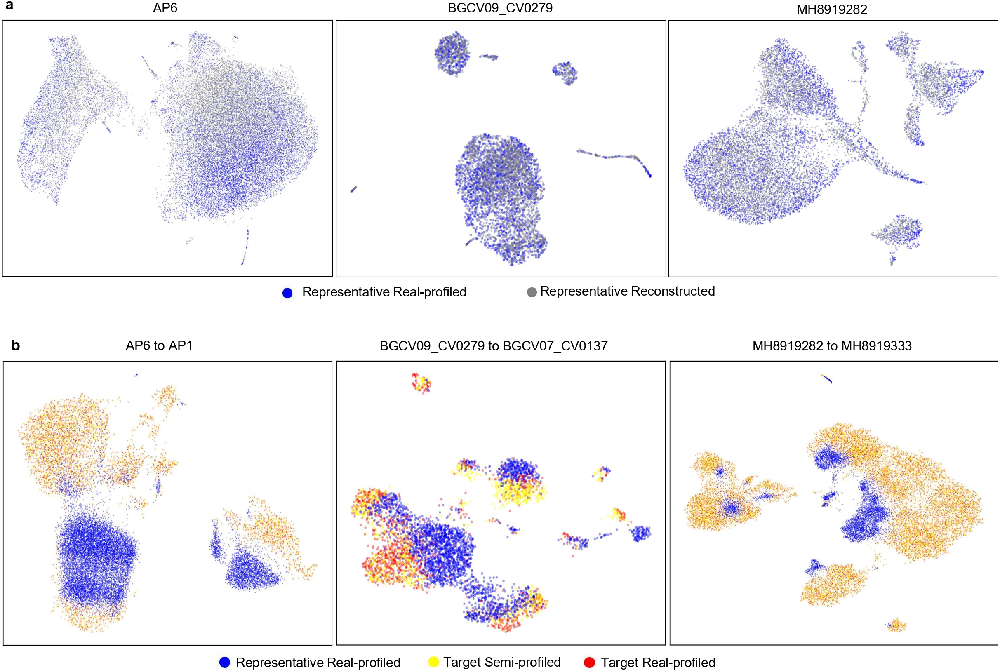
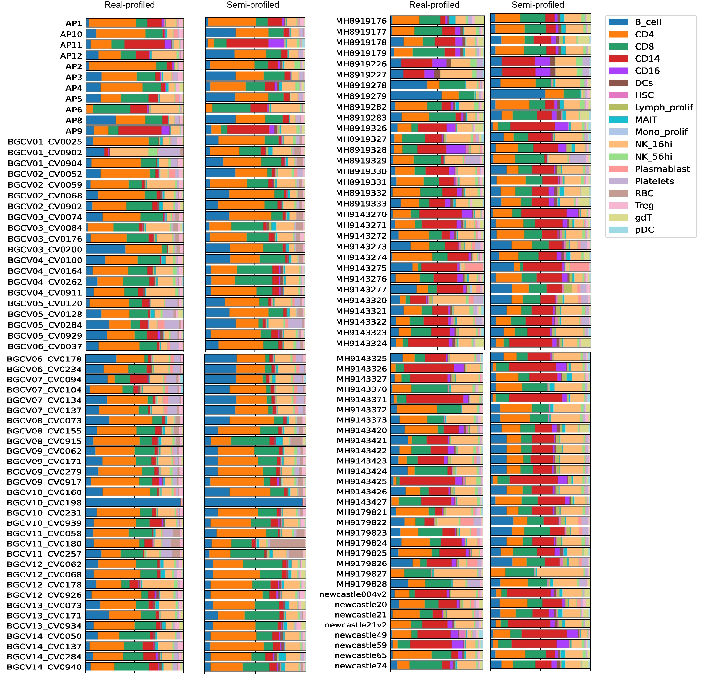

Gallery
=========

**Reconstruction and Inference:**

Images in the first row show the deep generative model's reconstruction ability. Images in the second row show the inferred single-cell data for the target sample is highly similar to the ground truth.

**Cell Type Deconvolution:**

Samples in the semi-profiled dataset have nearly identical cell type compositions as the ones in the real-profiled datset.
