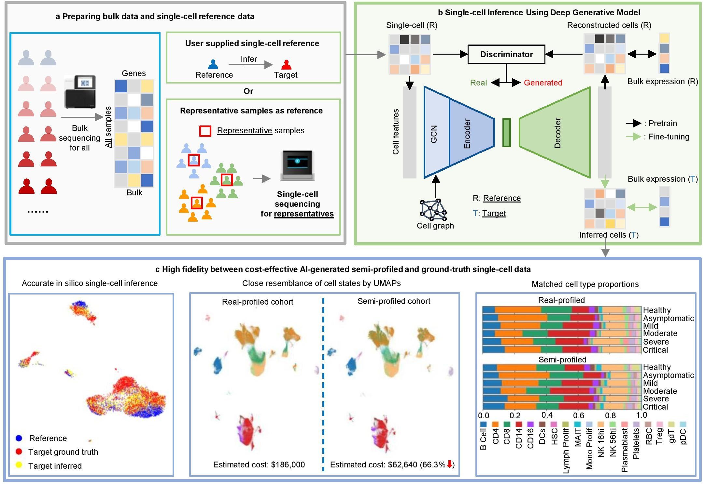

Welcome to the documentation for scSemiProfiler!
==================================

``scSemiProfiler``  is a computational tool combining deep generative models and active learning to economically generate single-cell data for biological studies. It efficiently transforms bulk cohort data into detailed single-cell data using templates from selected representative samples. More details are in our `paper <https://www.biorxiv.org/content/10.1101/2023.11.20.567929v1>`_. 

Methods Overview
----------------

For an interested cohort, scSemiProfiler runs the following steps to generate single-cell data for all samples.

**a**, Initial Setup: Bulk sequencing is first performed on the entire cohort, with subsequent clustering analysis of this data to pinpoint representative samples, typically those closest to the cluster centroids.

**b**, Representative Profiling: The identified representatives are then subjected to single-cell sequencing. The data obtained from this sequencing is further processed to determine gene set scores and feature importance weights, enriching the subsequent analysis steps.

**c**, Deep Generative Inference: This phase uses a VAE-GAN-based model to estimate single-cell data for a target sample. In its three-stage training, the model initially reconstructs the representative cells, and then produces target cells by analyzing the differences between the two samples as indicated by the bulk data.

**d**, Representative Selection Decision: Decisions are made on selecting additional representatives, considering budget limits and current representative effectiveness. An active learning algorithm, leveraging bulk data and the generative model insights, identifies new optimal representatives. These are then sequenced (**b**) and serve as and integrated as new references in the single-cell inference process (**c**).

**e**, Comprehensive Downstream Analyses: This final panel highlights the extensive analyses possible with semi-profiled single-cell data. It underscores the model’s ability to yield deep, diverse insights, demonstrating the full potential and broad applicability of the semi-profiled data.

.. note::

   This project is under active development.

Contents
--------

.. toctree::
   :maxdepth: 2

   install
   tutorials
   api
   gallery
   release
   credits
   contact
   references

